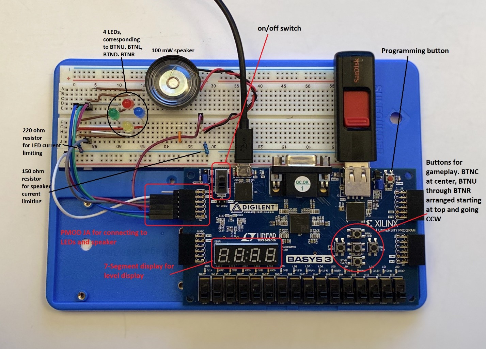
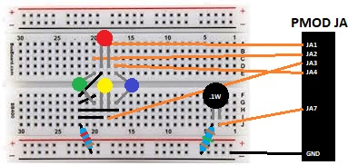
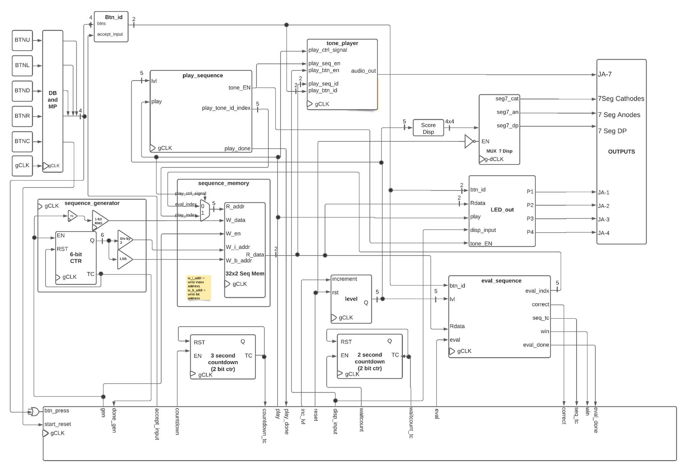

# Simon
## Connor Coale, Noah Daniel

### The Game
Simon is a memory game in which a player must memorize sequences of button presses. The common toy on which it is played consists of four buttons, each with colored LEDs contained within, and a speaker which plays a tone corresponding to each colored button. The toy will play a sequence of tones from start to finish, and the user must tap the corresponding buttons in correct order. Each time the user correctly completes the sequence, a random button will be added, and the sequence will be played again in its entirety. The goal is to get to the longest sequence possible before entering an incorrect or out of order sequence. 
### Our Implementation
#### Hardware
We wanted to create this game using VHDL to control an FPGA development board. We used Xilinx's Basys 3 Development board. There are five built in push-buttons, arranged in a star. We used the outer 4 buttons to control the sequence submissions. Additionally, 4 uniquely colored LEDs were controlled on a breadboard to correctly indicate which button had been either pressed or was to be played by the sequence. A small 100mW speaker was also added to the breadboard so that tones, which were the same notes as the original Simon game, could be played.
The following is a diagram indicating how the LEDs and speaker should be wired on the breadboard and to the Pmod connector on the Basys 3:

#### RTL 
We started by generating a large and very in depth RTL diagram of the overall circuit, as well as individual and more detailed RTL diagrams for each block. This made it a lot easier to tackle each individual component at the VHDL level concurrently.

#### VHDL Implementation
Following the elaborated RTL diagram, we were able to write each block as a VHDL components. These components were all plugged into a top-level shell, and the datapath was controlled by the controller which had state-logic in order to make the game work. 
The biggest component to tackle was sequence generation. Our Simon implementation could do sequences up to 32 tones long (we didn't end up accounting for sequences longer than this, as most humans are unable to go beyond about 20 tones with their memory at absolute best. maybe not the best practice, but it simplified things for us). We had an 8 bit Linear Feedback Shift Register to allow for pseudo random bit generation. In order to add a truly random seed, we simply used an 8 bit clock counter to seed the register based on a sample taken upon the user pressing the center button to start the game. With this, we knew we could generate sequences that seemed random enough to a user.
With the bit generation, we were able to populate a 32x2 block of DRAM with each 2-bit sequence corresponding to one of the four possible tones. From here (simplifying things of course), the game needed to be able to track which level the player was on - easily accomplished with a 5 bit counting register - and to be able to play the sequence of corresponding length. It also needed to be able to compare the entered sequence to the sequence at the given level, and also be able to play the tone corresponding to sequence playthroughs and button presses.